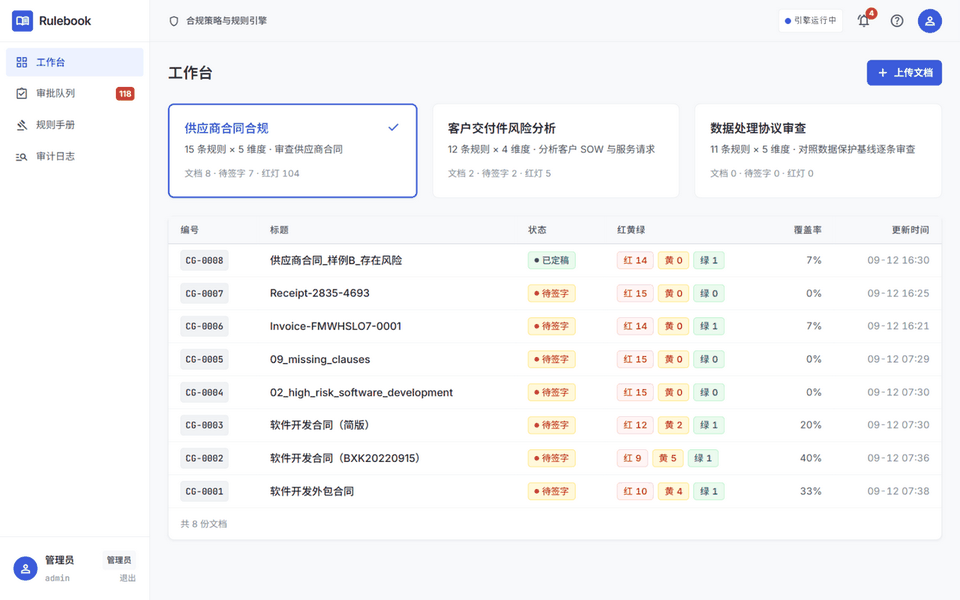

<div align="center">

# Rulebook · 规则手册驱动的文档审查平台

**一套受治理的文档审查引擎**：文档进来 → 按可编辑的规则手册逐条体检 → 每条判定带原文引用的红黄绿记分卡 → 红/黄必须专家签字 → 导出交付物 → 全程审计可追问。**换业务域只换剧本（规则手册），不改一行代码。**

[](https://github.com/ZQR1101/rulebook/actions/workflows/tests.yml)

[](LICENSE)

业务方向 · 快速开始 · 引擎流水线 · 治理内核 · API · CLI · 两套剧本 · 附录：RAG 基准（遗留能力）

</div>

<div align="center">
  
  <p><sub>演示闭环：三套剧本工作台 · 逐条判定与原文引用 · 审批队列红灯置顶 · 规则手册治理 · 全程审计</sub></p>
</div>


## 🎯 解决什么问题

组织里反复出现一类工作：**把一份文档，对照一套标准逐条检查，给出结构化判定，再交人签字**——典型如供应商合同合规审查、咨询公司的客户交付件（SOW / 服务请求）风险分析。人工做法有五个结构性失败：

| 现状失败 | 本平台的机制 |
|---|---|
| **慢**：一份合同人工 2–4 小时 | 引擎分钟级初筛出红黄绿记分卡，人只看机器标出的问题项 |
| **判定不一致**：标准在审阅者脑中 | 规则手册存在数据库，管理员随时编辑，下一份文档立即生效 |
| **无证据**：判定不给原文依据 | **强制引用门**：每条判定必须引用文档原文，无引用自动降级"待人工" |
| **不可审计**：谁批的查不到 | AI 只做初筛；红/黄必须**专家签字**才定稿导出；全程 append-only 审计 |
| **漏检静默失败** | 全部规则逐条判定；标准在文档中找不到对应内容时亮红 + 缺口说明 |

业务依据与方向细节见 [docs/BUSINESS_DIRECTION.md](docs/BUSINESS_DIRECTION.md)。

## 🚀 快速开始

```bash
# 1) 安装依赖（源码方式）
pip install -r requirements.txt

# 2) 配置模型 key
cp .env.example .env   # 编辑 DEEPSEEK_API_KEY 等；默认模型 deepseek-flash（成本友好，可用 DEEPSEEK_MODEL 换 deepseek-v4-pro）

# 3) 启动 API 服务（含认证与全部 REST 端点）
rulebook serve          # http://127.0.0.1:8000/docs

# 4) 无头审查一份文档，直接打印记分卡
rulebook review samples/供应商合同_样例B_存在风险.txt --playbook contract-compliance

# 5) 或开启收件箱监听：文档落入 data/inbox/ 即自动审查（零接触闭环）
rulebook inbox --playbook contract-compliance

# 6) 邮件闭环：邮件发到指定邮箱，附件自动评审，报告自动回邮
rulebook mail --playbook contract-compliance
```

首次启动自动创建管理员账号 `admin`（随机密码写入 `data/bootstrap_admin_password.txt`，或用 `AUTH_ADMIN_PASSWORD` 指定）。

### 邮件闭环配置（已实测通过 ✅）

1. 邮箱网页版开启 **IMAP/SMTP 服务**并生成**授权码**（QQ 邮箱：设置 → 账号 → POP3/IMAP/SMTP 服务 → 发短信验证；Gmail 用应用密码。Outlook 个人版已淘汰基本认证，不适用）
2. `.env` 填写：`MAIL_*`（收件）、`EMAIL_*`（发件，同一授权码）、`NOTIFY_EMAILS`（通知收件人列表）
3. 主题带剧本标签可路由业务：`[CG]`→合同合规、`[DI]`→交付件分析、`[DPA]`→DPA 审查
4. 全链路：**邮件进 → 几分钟内评分记分卡邮件回邮 → 专家在工作台签字 → 定稿报告 Word 附件自动回邮**

运维注意：修改 `.env` 后需重启服务生效；`rulebook mail` 首次运行会把收件箱历史未读全部跳过并标记已读（其中带可解析附件的会被当真文档评审）。

## 🏗️ 引擎流水线

```
入口（Web 上传 / 收件箱监听）
  → 解析（PDF/docx/md/txt → 条款切分，确定性、可复现）
  → 逐条评分（每条规则 → 条款检索 → LLM 判定 → 强制引用门）
  → 记分卡（红黄绿计数 · 风险指数 · 覆盖率 · 分维度汇总）
  → 签字门（红/黄 → 专家批准 / 驳回 / 改判）
  → 交付物（Word 报告 / xlsx 矩阵 / 调研简报 / 交接文档）+ 审计 + 文档内追问
```

## 🛡️ 治理内核（六条硬约束）

1. **强制引用门**——绿色判定必须带有效原文引用（空白归一化后的逐字包含校验），否则降级 amber + 待人工。
2. **签字门状态机**——`drafted → awaiting_review → approved / edited / rejected`，非法迁移一律 422 拒绝；驳回必须填专家意见。
3. **终稿门**——存在待签字判定时禁止定稿、禁止导出；已定稿文档不可再改判。
4. **幂等去重**——上传按内容哈希去重（409 + 指向已有记录）；收件箱重复文件归档不重审；重复定稿幂等返回。
5. **失败路径显式建模**——解析失败 / 模型输出不可解析 / 证据不足都有明确状态、原因与审计事件，绝不静默吞掉。
6. **全程审计**——append-only `audit_log`，correlation ID（如 `CG-0007`）贯穿文档生命周期每个事件。

## 📡 API（全部要求登录，Bearer token 或会话 cookie）

| 组 | 端点 |
|---|---|
| 认证 | `POST /auth/login` · `POST /auth/logout` · `GET /auth/me` · `GET/POST/PATCH /auth/users`（admin） |
| 文档 | `GET /documents/playbooks` · `POST /documents/upload` · `GET /documents` · `GET /documents/{id}` · `POST /documents/{id}/process` · `GET /documents/{id}/runs` · `GET /documents/{id}/audit` · `GET /documents/audit/recent` |
| 评审 | `GET /documents/review/queue`（红灯置顶） · `PATCH /documents/{id}/verdicts/{vid}`（approve/edit/reject） · `POST /documents/{id}/finalize` · `GET /documents/{id}/review-events` |
| 交付 | `GET /documents/{id}/export?format=docx\|xlsx`（仅限已定稿） · `POST /documents/{id}/ask`（带条款引用的追问） |

## 🧰 CLI

| 命令 | 说明 |
|---|---|
| `rulebook serve` | 启动 API 服务 |
| `rulebook review <file> --playbook <id>` | 无头审查单份文档并打印记分卡 |
| `rulebook inbox --playbook <id> [--interval N] [--once]` | 监听文件夹自动收件 |
| `rulebook mail --playbook <id> [--interval N] [--once]` | IMAP 邮件收件（附件自动评审，主题标签路由剧本） |
| `rulebook init` / `check` | 初始化 / 环境体检 |

## 📚 两套剧本（同一个引擎）

| | 剧本一 · 供应商合同合规 | 剧本二 · 客户交付件风险分析 |
|---|---|---|
| `playbook_id` | `contract-compliance` | `delivery-intake` |
| 用户 | 采购 / 法务 | 咨询 PM / 交付负责人 |
| 规则手册 | 15 条 × 5 维度（商业/法律/数据隐私/SLA与绩效/监管） | 12 条 × 4 维度（完整性/风险/商务/合规） |
| 交付物 | 合规审查 Word 报告 + xlsx 记分矩阵 | 需求调研简报 + Word 交接文档 |
| 样例 | `samples/供应商合同_样例A_条款完备.txt`（全绿基线）、`样例B_存在风险.txt` | `samples/客户SOW_样例_信息不全.txt` |

**"规则即数据"的可验证性**：剧本注册只需一份 `PlaybookSpec` 数据（维度 + 规则种子 + 交付物键），引擎零改动。测试 `test_new_vertical_is_data_only` 用一个玩具剧本现场证明了这一点。规则入库后管理员可直接编辑，改一条下一份文档立即生效。

<details>
<summary><b>附录 · 遗留能力：学习助手与 RAG 基准</b></summary>

本仓库前身是 AI Study Assistant（学习场景 RAG 应用），其检索核（`rag_store` / `rag_service` / `reranker`）与本平台的条款检索同源，现仍随服务提供：

- **Local RAG**：FAISS + BM25 + Hybrid RRF + CrossEncoder Reranker，结构化 Chunk + 元数据增强。
- **RAG Benchmark**：V3 语料 63 Docs / 1438 Chunks / 55 Cases；`Hybrid + Reranker` Top-1 90.0%、MRR 0.938；Source Pollution 100% → 26.7% 的修复记录与全部消融实验见 [reports/RAG_V1_V2_V3_BENCHMARK.md](reports/RAG_V1_V2_V3_BENCHMARK.md) 等系列报告。
- **Tool Safety**：`read/write/dangerous` 分级 + requester/approver 双凭据 + Pending Action 审批（本平台签字门的设计先声）。
- **Run Observability**：`/runs/{id}` 聚合 Trace / Sources / Tool Calls / Token / Cost。

学习助手的前端工作台与学习记忆仍在（`ENABLE_MEMORY`、`/chat`），计划在后续版本中由审查工作台 UI 替换。

</details>

## ✅ 测试

```bash
pytest   # 482 tests：认证/种子数据、引擎三路径（happy/duplicate/failure）、治理、邮件、检索模式、规则建议、
         # 治理（非法迁移/终稿门/幂等）、收件箱、既有 RAG/工具安全回归
```

## ⚠️ 当前限制（v1.1）

- 邮件入口已实测（QQ 授权码 + Gmail 收件人），但退信/限流告警面板、邮件服务健康监控尚无。
- 扫描版 PDF 的 OCR 文本可提取，但 OCR 质量对评分的影响未做专项评测。
- 条款检索默认 hybrid（语义+关键词），超长合同可通过 `RETRIEVAL_MODE` 与 `MAX_RULE_CONTEXT_CHARS` 调优。
- 单机单库（SQLite WAL），面向 3–15 人小团队；多租户与外部邮件（IMAP）触发在路线图上。

## 🗺️ v1.1 已交付 & 后续路线

**v1.1 新增**：语义/混合条款检索（`RETRIEVAL_MODE=hybrid`，本地 embedding，失败自动回退 keyword 并审计）、IMAP 邮件收件（`rulebook mail`，主题标签路由剧本）+ SMTP 通知（定稿邮件自动附 Word 报告）、应用内通知中心、文档内追问面板、规则建议 agent（生成式起草，管理员确认入库）、第三剧本 DPA 数据处理协议审查（纯数据落地，引擎零改动）。

**后续候选**：ESG 等更多业务域、文档对比与供应商历史档案、WebSocket 实时推送、多租户与用户个人设置、Celery 任务队列、OCR 评分增强。

**评测工具**：`scripts/evaluate_review_engine.py`（引用命中率/拒答正确率，真实 LLM）、`scripts/evaluate_retrieval.py`（选段命中率 keyword/semantic/hybrid 三模式对比）、`scripts/evaluate_review_engine.py --fake`（离线 harness 验证）。

## 🙏 致谢

设计参考了 Microsoft Agent Academy Hackathon Operative Track 冠军 [VendorGuard](https://github.com/experienceswithanishh/vendorguard-copilot-studio)（自主合规闭环 + 规则即数据 + 记分卡叙事）与第二名 [Engagement Hub](https://github.com/leila-marspooner/engagement-hub-agent)（人工审批门、幂等去重、审计与失败路径治理），以及 [FastAPI](https://github.com/fastapi/fastapi)、[LangChain](https://github.com/langchain-ai/langchain)、[FAISS](https://github.com/facebookresearch/faiss)、[sentence-transformers](https://github.com/UKPLab/sentence-transformers)、[python-docx](https://github.com/python-openxml/python-docx)、[openpyxl](https://foss.heptapod.net/openpyxl/openpyxl) 等开源项目。

如果这个项目对你有帮助，欢迎点一个 Star ⭐
